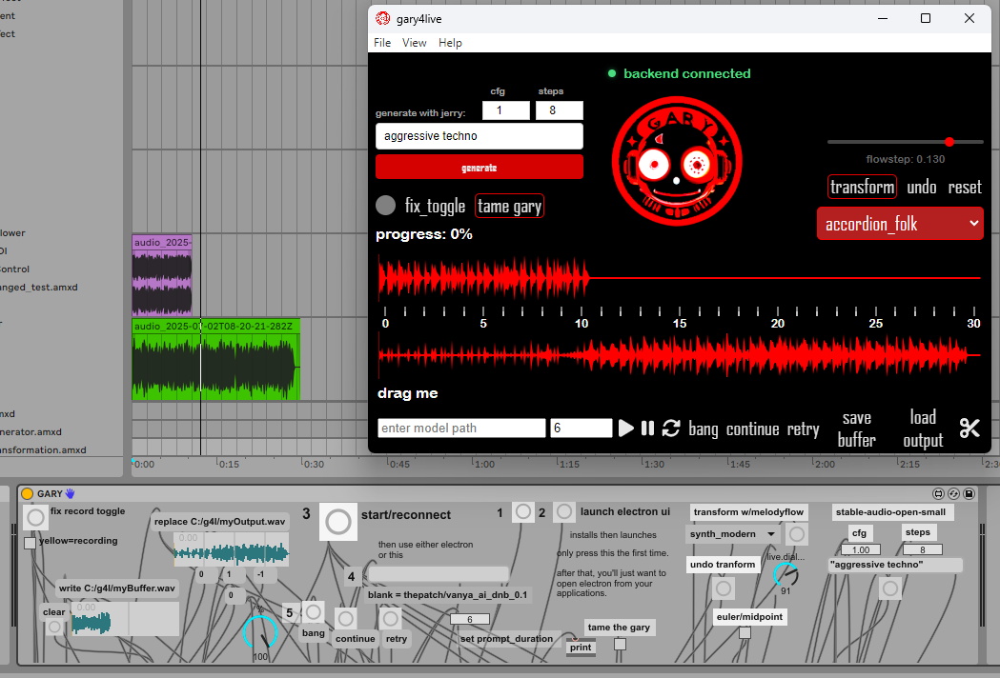

# gary4live

this is gary4live. gary iterates on input audio using max for live and musicgen.

there is an installer for pc as well as for mac, but if you would rather build it yourself, it's really easy.

## update july_2_2025
### gary's now got two lil buddies lol...jerry and terry



jerry is just our nickname for the stable-audio-open-small model. it generates 12 seconds of audio in under a second when using a gpu. it makes great input audio for gary's continuations. 

https://huggingface.co/stabilityai/stable-audio-open-small 

meta's new melodyflow model (terry) can be used inside this device now to transform input audio. it generates audio the same length as the input. you can have terry transform your recorded buffer or the outputs gary gives back (up to ~40 secs). terry's got 'presets' you can choose from.

https://huggingface.co/spaces/facebook/melodyflow (you can play with terry here too)

## installation

this repo was designed for the root directory to be placed in `C:\g4l` for maximum simplicity. dynamic filepaths are a pain in the ass in the max for live gui. sry.

these paths can be changed with some effort (more instructions at the bottom)

### prerequisites

**node.js** - install first:
https://nodejs.org/en/download/

**ffmpeg** - required for audio cropping:

1. download ffmpeg for windows: https://ffmpeg.org/download.html
2. extract the downloaded folder  
3. **rename the extracted folder to `ffmpeg`**
4. **move the entire `ffmpeg` folder to `C:\g4l\ffmpeg`**
5. the final structure should be `C:\g4l\ffmpeg\bin\ffmpeg.exe`

### setup

clone this repository:
```bash
git clone https://github.com/betweentwomidnights/gary4live
```

rename the directory:
```bash
mv gary4live g4l
```

**install backend dependencies** (required for max for live communication):
```bash
cd C:\g4l
npm install
npm audit fix
```

navigate to the frontend directory:
```bash
cd C:\g4l\g4l-ui
```

**install frontend dependencies:**
```bash
npm install
npm install @types/react@latest @types/react-dom@latest
npm install sass-loader@latest
```

## security note

when running `npm audit`, you may see 2 moderate vulnerabilities:

- **electron <28.3.2**: affects image processing (we don't process user images)
- **webpack-dev-server**: affects development mode only (not production builds)

**we intentionally don't fix these because:**
1. `npm audit fix --force` breaks the electron app (requires major refactoring)
2. our app only communicates locally with ableton live (no internet access)
3. the vulnerabilities don't apply to our specific use case

for a local music production tool, these pose minimal security risk.

## running the app

to start the application in development mode:
```bash
npm run start
```

to create the executable that the '2(launch electron)' button triggers in gary4live:
```bash
npm run package
```

## using with ableton

in the ableton browser, add the g4l folder.  

`GARY.amxd` is the device.

## backend configuration

by default, gary4live connects to our free hosted backend at `g4l.thecollabagepatch.com`. we run this for free and collect zero user data cuz that would be too much work.

### using localhost backend

if you want to run the backend locally (requires **6gb+ gpu ram**, preferably 12gb+), you can build it from: https://github.com/betweentwomidnights/gary-backend-combined

**to switch to localhost:**

1. open `commentedout.js` in your `C:\g4l` directory
2. find this configuration section:

```javascript
// =============================================================================
// CONFIGURATION - Change these URLs when building from source with localhost
// =============================================================================

// For localhost development with our github repo https://github.com/betweentwomidnights/gary-backend-combined
// Uncomment these lines and comment out the production URLs below:
// const BACKEND_URL = 'http://localhost:8000';
// const STABLE_AUDIO_HOST = 'localhost';
// const STABLE_AUDIO_PORT = 8005;
// const STABLE_AUDIO_PATH = '/generate';  // Direct to service
// const USE_HTTPS = false;

// Production URLs (default):
const BACKEND_URL = 'https://g4l.thecollabagepatch.com';
const STABLE_AUDIO_HOST = 'g4l.thecollabagepatch.com';
const STABLE_AUDIO_PORT = 443;
const STABLE_AUDIO_PATH = '/audio/generate';  // Through Caddy proxy
const USE_HTTPS = true;
```

3. **comment out the production urls and uncomment the localhost urls**

## troubleshooting

**ffmpeg not found error:**
- make sure ffmpeg is extracted to `C:\g4l\ffmpeg\bin\ffmpeg.exe`
- alternatively, install ffmpeg system-wide via chocolatey: `choco install ffmpeg`

**generations stuck at 80%:**
- check file permissions on `myBuffer.wav` and `myOutput.wav`
- avoid manually editing these files

**electron app won't start:**
- make sure you ran the updated npm install commands
- don't run `npm audit fix --force` as it breaks the app

**mac users:**
- there's a separate repository for the mac front-end: https://github.com/betweentwomidnights/gary-mac

## advanced usage

if you want to change filepaths, the two buttons in the m4l gui need to be changed, as well as all the filepaths for `myBuffer.wav` and `myOutput.wav` in 'electron-communication.js' and 'commentedout.js'

warning: you are going to give yourself headaches. max rly likes to gaslight.

the final remaining edge cases revolve around these two files: `myBuffer.wav` and `myOutput.wav`. if generations get stuck at 80%, or you do not see the 'write' button actually changing `myBuffer.wav`, you have hit this issue with permissions.

**do NOT:**
- drag them into the timeline (the 'drag me' option in electron is fine. that's a copy of myOutput.wav)
- manually change `myBuffer.wav` to a 6 minute audio file. it should only be changed by our write function and should be a maximum of 30 seconds

## support

if you rly wanna learn how to use this thing, head to discord https://discord.gg/VECkyXEnAd and yell at me @kev, or go to https://youtube.com/@thepatch_dev

## related repositories

- backend: https://github.com/betweentwomidnights/gary-backend-combined
- mac frontend: https://github.com/betweentwomidnights/gary-mac